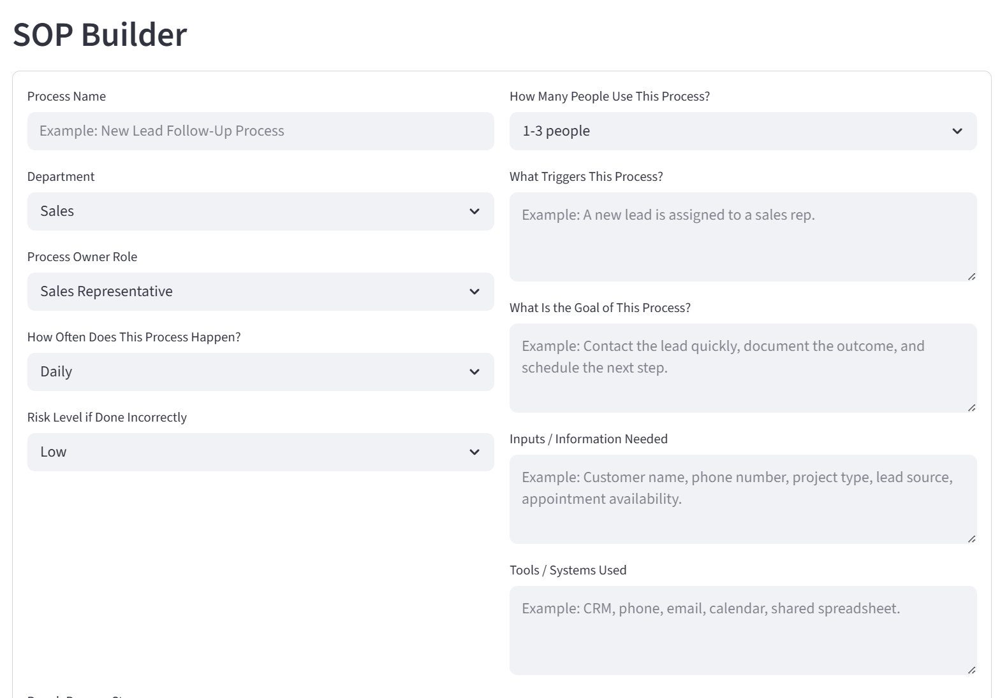
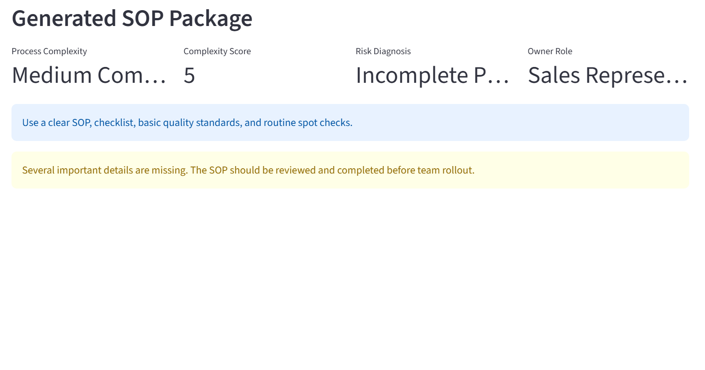
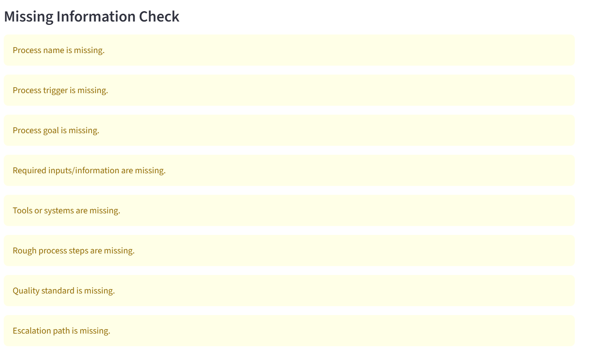
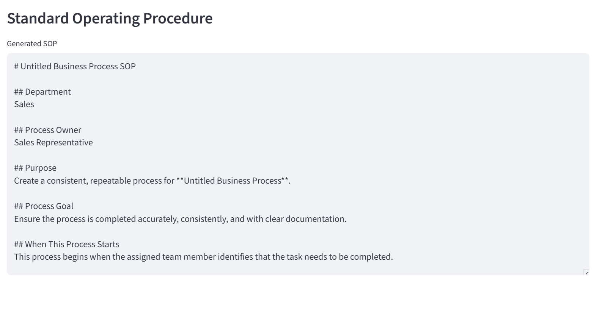
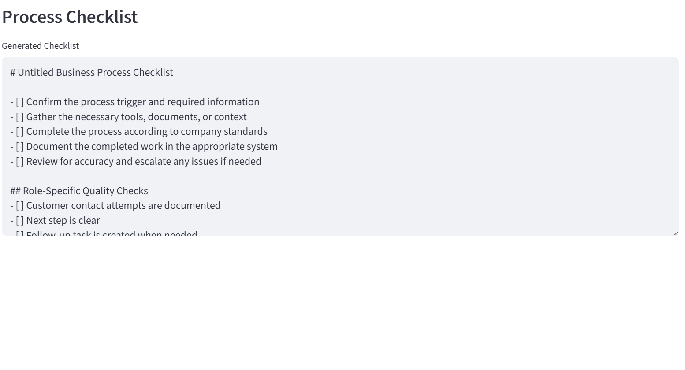
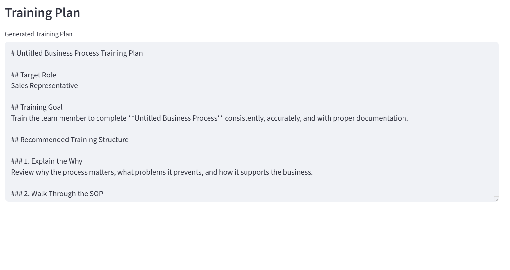
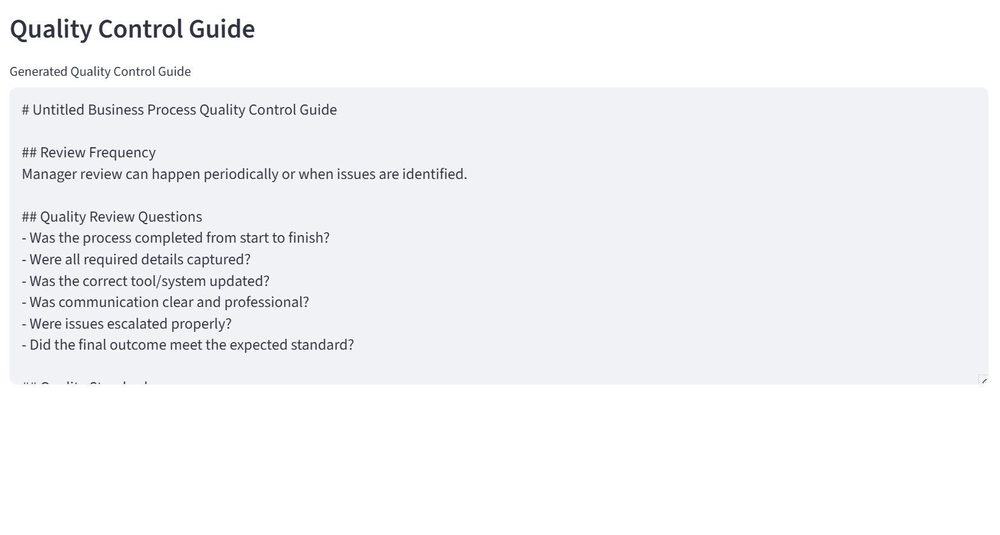
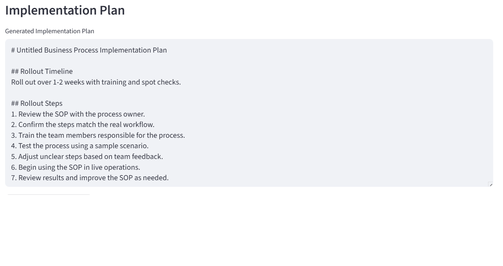

# SOPPilot AI

SOPPilot AI is an AI-assisted SOP, checklist, and training document generator for small-business teams.

It helps managers turn rough process notes into:

- Standard Operating Procedures
- Process checklists
- Missing-information checks
- Process risk diagnoses
- Training plans
- Quality control guides
- Implementation plans
- Downloadable SOP packages

## Live Demo

[Launch SOPPilot AI](https://soppilot-ai.streamlit.app/)

## Why this project exists

Small and mid-sized businesses often rely on tribal knowledge, verbal instructions, scattered notes, and inconsistent training. SOPPilot AI helps convert messy process knowledge into repeatable documentation that teams can use to improve consistency.

## Who this helps

SOPPilot AI is designed for:

- Small business owners
- Operations managers
- Sales managers
- Project managers
- Customer service leaders
- Recruiting managers
- Team leads
- Process improvement teams

## What it does

The app allows users to enter process information and rough steps, then generates:

- Process complexity level
- Complexity score
- Risk diagnosis
- Missing-information check
- Improvement recommendations
- Standard Operating Procedure
- Process checklist
- Training plan
- Quality control guide
- Implementation plan
- Downloadable Markdown SOP package

## Screenshots

### SOP Builder



### Generated SOP Package Metrics



### Missing Information and Recommendations



### Standard Operating Procedure



### Process Checklist



### Training Plan



### Quality Control Guide



### Implementation Plan and Download



## Tech Stack

- Python
- Streamlit
- Rules-based AI-style workflow logic
- Markdown report export

## Portfolio Purpose

This project was built as part of Bradley Hankins' AI operations and workflow automation portfolio.

SOPPilot AI demonstrates how practical AI-assisted tools can help small and mid-sized businesses improve documentation, training consistency, process handoffs, quality control, rollout planning, and manager accountability.

## Run Locally

```bash
py -m pip install -r requirements.txt
py -m streamlit run app.py
```

## Public Demo Note

All sample data, names, companies, and scenarios used in this project are fictional and created for public portfolio demonstration purposes.

## Built By

Bradley Hankins  
Operations & Revenue Leader | Technology & AI Workflow Integration

## Case Study

### Problem

Small and mid-sized businesses often rely on tribal knowledge, verbal instructions, scattered notes, and inconsistent training. This creates confusion when processes need to be repeated, taught, reviewed, or improved.

Common issues include:

- No written SOPs
- Inconsistent training
- Unclear process ownership
- Missed steps
- Weak quality control
- Poor handoffs
- No escalation path
- Managers repeatedly explaining the same process

### Solution

SOPPilot AI was built as a lightweight AI-assisted process documentation tool.

The app allows a manager to enter rough process details, then generates:

- Process complexity score
- Risk diagnosis
- Missing-information check
- Improvement recommendations
- Standard Operating Procedure
- Process checklist
- Training plan
- Quality control guide
- Implementation plan
- Downloadable SOP package

### My Role

I designed and built this project from concept to deployment, including:

- Defining the business process documentation problem
- Designing the SOP input workflow
- Mapping process complexity logic
- Creating process risk diagnosis logic
- Building the Streamlit app
- Writing the rules-based AI-style documentation generator
- Creating downloadable Markdown SOP packages
- Preparing fictional sample scenarios for public portfolio use
- Publishing the project on GitHub
- Deploying the live demo

### Business Value

SOPPilot AI helps small and mid-sized businesses turn informal knowledge into repeatable process documentation.

The tool can help teams:

- Reduce tribal knowledge
- Standardize training
- Improve handoffs
- Clarify ownership
- Improve quality control
- Create manager review checkpoints
- Reduce repeated explanations
- Build repeatable operating systems

### Future Improvements

Planned future improvements include:

- OpenAI API integration for dynamic SOP generation
- PDF exports
- SOP template library
- Saved process libraries
- Role-based training packages
- Team process dashboards
- Approval workflows
- Version history