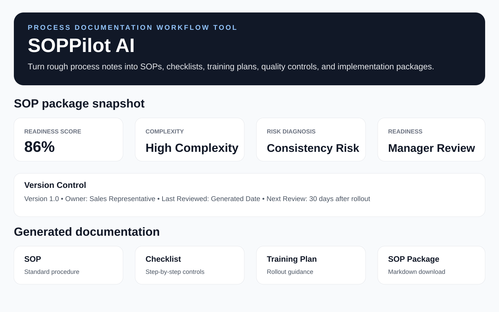

# SOPPilot AI

SOPPilot AI is an AI-enhanced process documentation and training workflow assistant for small-business teams.

It helps managers turn rough process notes into:

- Standard Operating Procedures
- Process checklists
- Missing-information checks
- Process risk diagnoses
- Rollout readiness guidance
- Manager-ready process summaries
- Training plans
- Quality control guides
- Implementation plans
- AI-enhanced complete SOP packages with rules-based fallback
- Downloadable SOP packages

## Live Demo

[Launch SOPPilot AI](https://soppilot-ai.streamlit.app/)

## Current Version: v2.2

SOPPilot AI combines a rules-based process documentation engine with embedded AI-enhanced SOP package generation.

The app is designed to work in two layers:

1. **Rules-based core:** creates SOPs, checklists, training plans, quality control guides, implementation plans, readiness scores, risk checks, and version-control blocks.
2. **Embedded AI layer:** when an OpenAI token is available, the app quietly improves the complete SOP package into a cleaner, more manager-ready document.

If the AI call fails or an API key is unavailable, the app silently falls back to the rules-based SOP package. The user experience stays the same.

## Why this project exists

Small and mid-sized businesses often rely on tribal knowledge, verbal instructions, scattered notes, and inconsistent training. SOPPilot AI helps convert messy process knowledge into repeatable documentation that teams can use to improve consistency.

## Workflow Outputs

- Public-safe sample process scenarios
- Process ownership inputs
- Process risk and usage inputs
- Rough workflow input
- Quality and escalation inputs
- Documentation readiness score
- Version control block
- Process complexity logic
- Risk diagnosis logic
- Rollout readiness guidance
- Missing-information check
- Improvement recommendations
- Manager-ready process summary
- Standard Operating Procedure generator
- Process checklist generator
- Training plan generator
- Quality control guide generator
- Implementation plan generator
- AI-enhanced complete SOP package with rules-based fallback
- Downloadable Markdown SOP package

## Export Strategy

Current export:

- Markdown SOP package (`.md`) for GitHub-friendly and developer-friendly documentation

Planned next upgrade:

- PDF SOP package for a more user-friendly manager/training deliverable

The markdown export is useful for transparency and version control, but PDF is the better format for non-technical users.

## Suggested Test Flow

1. Launch the live demo.
2. Load the “New Lead Follow-Up” sample process.
3. Generate the SOP package.
4. Review the documentation readiness score, version control block, complexity, risk diagnosis, and rollout readiness snapshot.
5. Review the missing-information check and improvement recommendations.
6. Review the SOP, checklist, training plan, quality control guide, implementation plan, and AI-enhanced complete package.
7. Download the SOP package.

## Screenshots

### Readiness Score and Version Control



## Tech Stack

- Python
- Streamlit
- OpenAI API integration
- Rules-based process documentation logic
- Silent AI fallback pattern
- Markdown report export
- GitHub
- Streamlit Community Cloud

## Run Locally

```bash
py -m pip install -r requirements.txt
py -m streamlit run app.py
```

## Environment Variables

To enable embedded AI output:

```bash
OPENAI_TOKEN=your_api_key_here
```

The app still works without this token by using the rules-based fallback.

## Public Demo Note

All sample data, names, companies, and scenarios used in this project are fictional and created for public portfolio demonstration purposes.

## Case Study

### Problem

Small and mid-sized businesses often rely on tribal knowledge, verbal instructions, scattered notes, and inconsistent training. This creates confusion when processes need to be repeated, taught, reviewed, or improved.

### Solution

SOPPilot AI turns rough process details into a complete SOP package with scoring, version control, risk guidance, checklists, training plans, quality control, and implementation planning. The embedded AI layer improves the complete package when available while preserving a reliable rules-based fallback.

### Business Value

SOPPilot AI helps small and mid-sized businesses turn informal knowledge into repeatable process documentation.

## Built By

Bradley Hankins  
Operations & Revenue Leader | AI Workflow Automation | RevOps & Process Improvement
